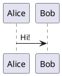

# Silver Bullet plug for PlantUML diagrams

Fork of [LogeshG5/silverbullet-plantuml](https://github.com/LogeshG5/silverbullet-plantuml)
that fetches diagrams with the browser's own `fetch` (frontend fetch) instead of
the SilverBullet server proxy, falling back to the proxy when the browser cannot
reach the PlantUML server. Works in read-only/published spaces and while the
SilverBullet server is offline.

## Use

Put a plantuml block in your markdown:

````

````

And move your cursor outside of the block to live preview it!

## Configuration

Set the PlantUML server (and optionally the fetch mode) in your own `CONFIG` page:

    config.set("plantuml", {serverurl="https://www.plantuml.com/plantuml"})

`fetchmode` is optional: `"auto"` (default), `"frontend"`, or `"proxy"`.
`proxyurl` is optional: a separate base URL for the proxy fallback (useful when
only an `https` reverse proxy of the PlantUML server is reachable from the
browser). See the [repository README](https://github.com/liooil/silverbullet-plantuml#fetching).

> Deliberately not a `space-lua` block: code blocks in this page would run when
> the page is indexed, overriding whatever the space's own CONFIG sets.
