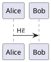

# Silver Bullet plug for PlantUML diagrams

This plug adds basic [PlantUML](https://www.plantuml.com) support to Silver Bullet.

> **This is a fork** of [LogeshG5/silverbullet-plantuml](https://github.com/LogeshG5/silverbullet-plantuml).
> Two changes: diagram requests are made with the browser's own `fetch` (the
> *frontend* fetch) instead of SilverBullet's server-side `/.proxy` endpoint,
> with an automatic fallback to the proxy (see [Fetching](#fetching)); and the
> plug is a single hand-written file with no build step (see
> [No build step](#no-build-step)).

## Installation

The plug is installed like any other plug using SpaceLua. Just add `ghr:liooil/silverbullet-plantuml` to the plugs array in your CONFIG page.

```space-lua
config.set {
  plugs = {
  "ghr:liooil/silverbullet-plantuml"
  }
}
```

Run `Plugs: Update` command and off you go!

## No build step

`plantuml.plug.js` **is** the source: ~570 commented lines of plain JavaScript,
no dependencies, no bundler, no `node_modules`, no CI build. Download it into a
space, run `Plugs: Reload` and it is live; edit it in the space and reload again.
Two things upstream gets from its build, and what this fork does instead:

| Upstream build output | Here |
| --- | --- |
| plugos worker runtime + protocol (~3 KB) | the three messages of [client/plugos/protocol.ts](https://github.com/silverbulletmd/silverbullet/blob/main/client/plugos/protocol.ts) are implemented directly (`inv`/`invr`, `sys`/`sysr`, `manifest`) |
| `plantuml-encoder` (~54 KB, i.e. pako deflate) | `CompressionStream("deflate-raw")` + PlantUML's 64-character alphabet (~20 lines) |

A side effect of not embedding the runtime: the worker's `fetch` is the plain
browser fetch, so the frontend fetch is the natural default here instead of
something to be recovered from the patched `fetch`. The server proxy is still
available explicitly, through the `sandboxFetch.fetch` syscall.

`CompressionStream("deflate-raw")` needs a reasonably recent browser (Chrome/Edge
103+, Firefox 113+, Safari 16.4+) — the same league as what the SilverBullet 2.x
client itself requires.

## Fetching

Diagrams are fetched by the browser first, with the server proxy as a fallback:

| `fetchmode` | Who makes the request | Requires |
| --- | --- | --- |
| `frontend` | the browser, straight to the PlantUML server (`serverurl`) | CORS headers from the PlantUML server |
| `proxy` | the SilverBullet server (`/.proxy`, `proxyurl`, falls back to `serverurl`) | write access to the space, reachable server |
| `auto` (default) | `frontend`, falling back to `proxy` | — |

The default remote server (`https://www.plantuml.com/plantuml`) sends
`Access-Control-Allow-Origin: *`, so with `auto` the request never touches the
server proxy. That makes the plug work in read-only/published spaces and while
the SilverBullet server is unreachable. A self-hosted PlantUML server that does
not send CORS headers still works through the fallback.

> **Note**
> Use `www.plantuml.com`, not the apex `plantuml.com`: the apex answers with a
> 301 to `http://www.plantuml.com/…` that carries no CORS headers, so a browser
> fetch of it always fails and every diagram ends up going through the proxy
> fallback. (That is why this fork's default differs from upstream's.)

> **Note**
> An `https:` space cannot fetch a plain `http:` PlantUML server at all —
> browsers block that as mixed content. With `auto` such a target goes straight
> to the proxy; with `frontend` it fails with an explicit error. Serve the
> PlantUML server over `https` (a reverse proxy in front of it is enough) if you
> want the frontend fetch, e.g. `config.set("plantuml", {serverurl="https://plantuml.example.com/plantuml"})`.

To pin a mode explicitly (for example to keep diagrams off the client network,
or to avoid the failed frontend attempt on a CORS-less server):

```space-lua
config.set("plantuml", {serverurl="https://plantuml.com/plantuml", fetchmode="proxy"})
```

### Frontend URL and proxy URL may differ

The URL a browser should use is often not the URL the SilverBullet server
should use: a self-hosted PlantUML server is commonly plain `http:` inside the
network (unusable from an `https:` space, see above) while its `https:` reverse
proxy is what readers' browsers can reach. Set `proxyurl` to give the fallback
its own base URL:

```space-lua
config.set("plantuml", {
  serverurl = "https://plantuml.example.com/plantuml", -- browser (frontend fetch)
  proxyurl = "http://10.0.0.5:8080",                   -- SilverBullet server (fallback)
})
```

`proxyurl` defaults to `serverurl`.

## Dark mode

PlantUML has no automatic dark mode: a diagram's colors are baked into the
render, and the way to get a dark diagram is one of PlantUML's own
[dark themes](https://plantuml.com/theme) (`cyborg`, `superhero`, `hacker`,
`mars`, `materia`, `spacelab`, `black-knight`, …). Left alone, diagrams are
bright white boxes on SilverBullet's dark theme.

So a diagram is rendered **once per theme, on demand**: the widget renders the
variant for the theme the editor is in, and when the theme switches it asks the
plug for the other one — `renderVariant`, called from the widget through
`system.invokeFunction` — and swaps it in. Until that render arrives, and if it
never does, the variant that is on screen is shown inverted rather than as a
white box. Renders are cached per theme/server/source until the plug is
reloaded, so switching back and forth (or scrolling a diagram out of view and
back) renders nothing twice.

Which theme each variant uses is configuration; `darktheme` (default `cyborg`)
can be any PlantUML theme, `lighttheme` is optional:

```space-lua
config.set("plantuml", {
  darktheme = "superhero", -- any PlantUML theme; default "cyborg"
  lighttheme = "_none_",   -- optional, for the light variant
})
```

A diagram that sets its own `!theme` (or `skinparam`s) keeps them: the plug's
`!theme` is injected right after `@startuml`, and PlantUML applies the last one.

Several dark themes (`cyborg`, `cyborg-outline`, `superhero`,
`superhero-outline`, `hacker`, `materia`, `spacelab`, `black-knight`) leave the
background transparent, so SilverBullet's own background shows through instead
of a dark box; others (`mars`, `crt-green`, `reddress-darkblue`, …) paint a
background of their own.

Set `darktheme = false` (or `"_none_"`) to skip the dark render altogether:
dark mode then always inverts the light diagram.

The editor's dark mode is read while the widget is rendered
(`editor.getUiOption("darkMode")`), so an explicit dark mode gets the dark
diagram right away. When that setting follows the operating system it reports
nothing, and the widget renders the plain diagram first and asks for the dark
one as soon as it knows the resolved theme — that is the one case where the
inverted diagram is visible for a moment.

## Configuration

There are four types of configuration possible

1. [Remote Server](#1-remote-server-configuration)
2. [Docker Server](#2-docker-server-configuration)
3. [Local Server](#3-local-server-configuration)
4. [Script](#4-script-configuration)

### 1. Remote Server Configuration

Add this to your `SETTINGS.md`

```space-lua
config.set("plantuml", {serverurl="https://www.plantuml.com/plantuml"})
```

This configuration uses the offical PlantUML server to generate the diagram. If you do not want to send the data to PlantUML server check other configuration options.

### 2. Docker Server Configuration

Deploy your own PlantUML server with the [offical plantuml/plantuml-server](https://hub.docker.com/r/plantuml/plantuml-server) Docker image.

Use one of the following commands:

```bash
docker run -d -p 8080:8080 plantuml/plantuml-server:jetty
docker run -d -p 8080:8080 plantuml/plantuml-server:tomcat
```

Add this to your `SETTINGS.md`

```space-lua
config.set("plantuml", {serverurl="http://{ip or hostname}"})
```

> **Note**
> You might want to have a reverse proxy such as [Traefik](https://doc.traefik.io/traefik/), or [Caddy](https://caddyserver.com/) in front of the PlantUML container.
>
> **Note**
> A browser can only reach such a server directly if it sends CORS headers;
> otherwise the `proxy` fetch mode (or a CORS-enabled reverse proxy) is needed.

### 3. Local Server Configuration

[PlantUML](https://plantuml.com/download) needs to be installed in your machine at e.g., `/usr/local/bin/plantuml.jar`. Ensure you have the JDK installed on your system.

Launch a local PlantUML [http server](https://plantuml.com/picoweb).

```bash
java -jar /usr/local/bin/plantuml.jar -picoweb:8080
```

Add this to your `SETTINGS.md`

```space-lua
config.set("plantuml", {serverurl="http://localhost:8080"})
```

This configuration uses the local PlantUML server to generate the diagram. This doesn't send the data to PlantUML server. You will have to keep the local server running always.

### 4. Script Configuration

[PlantUML](https://plantuml.com/download) needs to be installed in your machine at e.g., `/usr/local/bin/plantuml.jar`. Ensure you have the JDK installed on your system.

The configured script is run with plantuml data encoded in base64 format as argument.

Create a helper script that decodes the input data and generate diagram. Copy the below contents to a script at e.g., `/usr/local/bin/gen_plantuml_svg`

Helper scripts for Linux & Windows can be found in [scripts](scripts) directory. Take a note to update the plantuml.jar paths.

```bash
#!/bin/bash
echo -e $1 | base64 -d | java -jar /usr/local/bin/plantuml.jar -tsvg -pipe
```

Make it an executable by running the following command

```bash
chmod a+x /usr/local/bin/gen_plantuml_svg
```

In your `SETTINGS.md` configure the path to the generator.

```space-lua
config.set("plantuml", {generator="/usr/local/bin/gen_plantuml_svg"})
```

This helper script is needed as I couldn't get to call the plantuml.jar directly from this plugin.

## Releasing

There is nothing to compile. Pushing to `main` runs
[Publish](.github/workflows/publish.yml), which re-points the `edge` tag and
uploads the committed `plantuml.plug.js` + `PLUG.md` as release assets (that is
what `ghr:` URIs resolve to). To publish by hand:

```bash
gh release create edge --title edge --notes "…" plantuml.plug.js PLUG.md
```

## Use

Put a plantuml block in your markdown:

````

````

And move your cursor outside of the block to live preview it!
