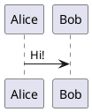

# Silver Bullet plug for PlantUML diagrams

This plug adds basic [PlantUML](https://www.plantuml.com) support to Silver Bullet.

> **This is a fork** of [LogeshG5/silverbullet-plantuml](https://github.com/LogeshG5/silverbullet-plantuml).
> The only behavioural change: diagram requests are made with the browser's own
> `fetch` (the *frontend* fetch) instead of SilverBullet's server-side `/.proxy`
> endpoint, with an automatic fallback to the proxy. See [Fetching](#fetching).

## Installation

The plug is installed like any other plug using SpaceLua. Just add `ghr:liooil/silverbullet-plantuml` to the plugs array in your CONFIG page.

```space-lua
config.set {
  plugs = {
  "ghr:liooil/silverbullet-plantuml"
  }
}
```

Run `Plugs: Update` command and off you go!

## Fetching

Plug code runs in a web worker in which SilverBullet replaces `fetch` with a
version that routes every request through the server's `/.proxy` endpoint (and
that endpoint requires write access). This fork prefers the browser's own
`fetch` instead, which the worker runtime keeps available as `nativeFetch`:

| `fetchmode` | Who makes the request | Requires |
| --- | --- | --- |
| `frontend` | the browser, straight to the PlantUML server (`serverurl`) | CORS headers from the PlantUML server |
| `proxy` | the SilverBullet server (`/.proxy`, `proxyurl`, falls back to `serverurl`) | write access to the space, reachable server |
| `auto` (default) | `frontend`, falling back to `proxy` | — |

The default remote server (`https://www.plantuml.com/plantuml`) sends
`Access-Control-Allow-Origin: *`, so with `auto` the request never touches the
server proxy. That makes the plug work in read-only/published spaces and while
the SilverBullet server is unreachable. A self-hosted PlantUML server that does
not send CORS headers still works through the fallback.

> **Note**
> Use `www.plantuml.com`, not the apex `plantuml.com`: the apex answers with a
> 301 to `http://www.plantuml.com/…` that carries no CORS headers, so a browser
> fetch of it always fails and every diagram ends up going through the proxy
> fallback. (That is why this fork's default differs from upstream's.)

> **Note**
> An `https:` space cannot fetch a plain `http:` PlantUML server at all —
> browsers block that as mixed content. With `auto` such a target goes straight
> to the proxy; with `frontend` it fails with an explicit error. Serve the
> PlantUML server over `https` (a reverse proxy in front of it is enough) if you
> want the frontend fetch, e.g. `config.set("plantuml", {serverurl="https://plantuml.example.com/plantuml"})`.

To pin a mode explicitly (for example to keep diagrams off the client network,
or to avoid the failed frontend attempt on a CORS-less server):

```space-lua
config.set("plantuml", {serverurl="https://plantuml.com/plantuml", fetchmode="proxy"})
```

### Frontend URL and proxy URL may differ

The URL a browser should use is often not the URL the SilverBullet server
should use: a self-hosted PlantUML server is commonly plain `http:` inside the
network (unusable from an `https:` space, see above) while its `https:` reverse
proxy is what readers' browsers can reach. Set `proxyurl` to give the fallback
its own base URL:

```space-lua
config.set("plantuml", {
  serverurl = "https://plantuml.example.com/plantuml", -- browser (frontend fetch)
  proxyurl = "http://10.0.0.5:8080",                   -- SilverBullet server (fallback)
})
```

`proxyurl` defaults to `serverurl`.

## Configuration

There are four types of configuration possible

1. [Remote Server](#1-remote-server-configuration)
2. [Docker Server](#2-docker-server-configuration)
3. [Local Server](#3-local-server-configuration)
4. [Script](#4-script-configuration)

### 1. Remote Server Configuration

Add this to your `SETTINGS.md`

```space-lua
config.set("plantuml", {serverurl="https://www.plantuml.com/plantuml"})
```

This configuration uses the offical PlantUML server to generate the diagram. If you do not want to send the data to PlantUML server check other configuration options.

### 2. Docker Server Configuration

Deploy your own PlantUML server with the [offical plantuml/plantuml-server](https://hub.docker.com/r/plantuml/plantuml-server) Docker image.

Use one of the following commands:

```bash
docker run -d -p 8080:8080 plantuml/plantuml-server:jetty
docker run -d -p 8080:8080 plantuml/plantuml-server:tomcat
```

Add this to your `SETTINGS.md`

```space-lua
config.set("plantuml", {serverurl="http://{ip or hostname}"})
```

> **Note**
> You might want to have a reverse proxy such as [Traefik](https://doc.traefik.io/traefik/), or [Caddy](https://caddyserver.com/) in front of the PlantUML container.
>
> **Note**
> A browser can only reach such a server directly if it sends CORS headers;
> otherwise the `proxy` fetch mode (or a CORS-enabled reverse proxy) is needed.

### 3. Local Server Configuration

[PlantUML](https://plantuml.com/download) needs to be installed in your machine at e.g., `/usr/local/bin/plantuml.jar`. Ensure you have the JDK installed on your system.

Launch a local PlantUML [http server](https://plantuml.com/picoweb).

```bash
java -jar /usr/local/bin/plantuml.jar -picoweb:8080
```

Add this to your `SETTINGS.md`

```space-lua
config.set("plantuml", {serverurl="http://localhost:8080"})
```

This configuration uses the local PlantUML server to generate the diagram. This doesn't send the data to PlantUML server. You will have to keep the local server running always.

### 4. Script Configuration

[PlantUML](https://plantuml.com/download) needs to be installed in your machine at e.g., `/usr/local/bin/plantuml.jar`. Ensure you have the JDK installed on your system.

The configured script is run with plantuml data encoded in base64 format as argument.

Create a helper script that decodes the input data and generate diagram. Copy the below contents to a script at e.g., `/usr/local/bin/gen_plantuml_svg`

Helper scripts for Linux & Windows can be found in [scripts](scripts) directory. Take a note to update the plantuml.jar paths.

```bash
#!/bin/bash
echo -e $1 | base64 -d | java -jar /usr/local/bin/plantuml.jar -tsvg -pipe
```

Make it an executable by running the following command

```bash
chmod a+x /usr/local/bin/gen_plantuml_svg
```

In your `SETTINGS.md` configure the path to the generator.

```space-lua
config.set("plantuml", {generator="/usr/local/bin/gen_plantuml_svg"})
```

This helper script is needed as I couldn't get to call the plantuml.jar directly from this plugin.

## Building

`plantuml.plug.js` is committed; rebuild it whenever `plantuml.ts` changes:

```bash
npm install
npm run build
```

The compiler is the `plug-compile` CLI that ships inside the
`@silverbulletmd/silverbullet` npm package — the same toolchain the official
[silverbullet-plug-template](https://github.com/silverbulletmd/silverbullet-plug-template)
uses. SilverBullet itself has been Deno-free since the
[Deno → Node.js migration](https://github.com/silverbulletmd/silverbullet/pull/1839)
(client build: npm + ESBuild + vitest, server: Rust), so this fork drops the
legacy `deno.jsonc` / `deno task build` / `import_map.json` from upstream. That
task had also stopped working: the published edge `plug-compile.js` is a Node
program and Deno can no longer resolve its dependencies (`Import "sass" not a
dependency`).

The [Publish](.github/workflows/publish.yml) workflow rebuilds the plug and
updates the `edge` release (which `ghr:` URIs resolve to) on every push to
`main`. To publish one by hand:

```bash
gh release create edge --title edge --notes "…" plantuml.plug.js PLUG.md
```

## Use

Put a plantuml block in your markdown:

````

````

And move your cursor outside of the block to live preview it!
